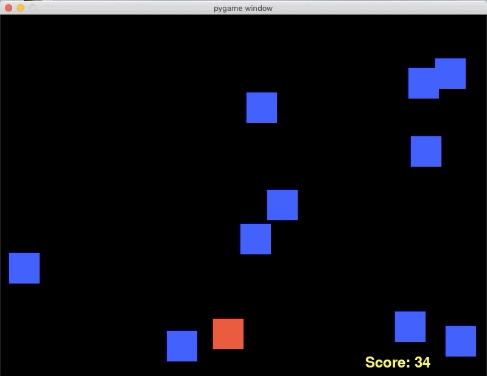

# Pygame
To play, you need to navigate past falling enemy blocks using the arrow keys. As you progresses through the game, the speed of the enemy blocks increase as well. 


## Inspiration
I wanted to learn how to code games using Python's Pygame library.  To get the hang of Pygame, I followed [this YouTube video](https://www.youtube.com/watch?v=-8n91btt5d8) and then I continued to work on the game by adding new features and getting rid of bugs. 

## Setup
Download or clone this repository and then run:
```ShellSession
$ pip3 install -r requirements.txt
$ python3 controller.py
```
